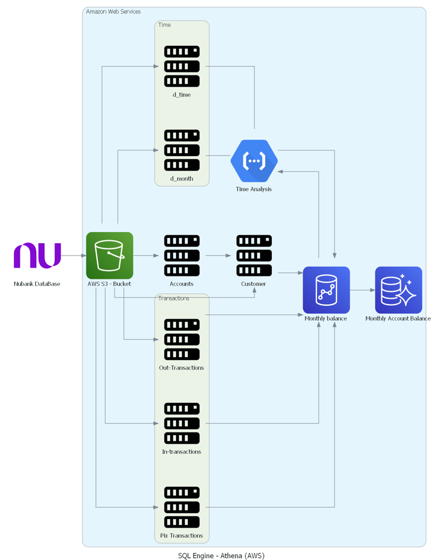
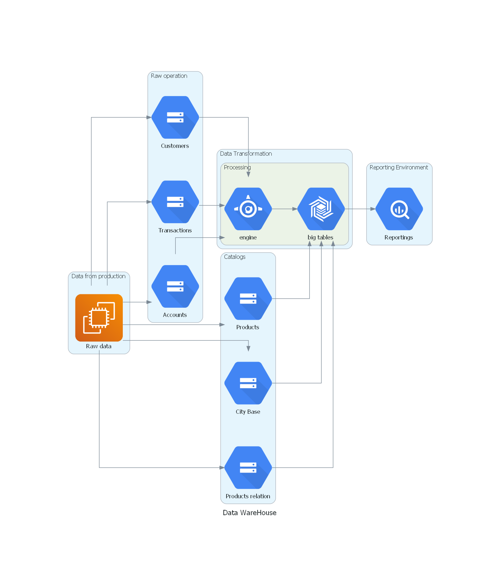
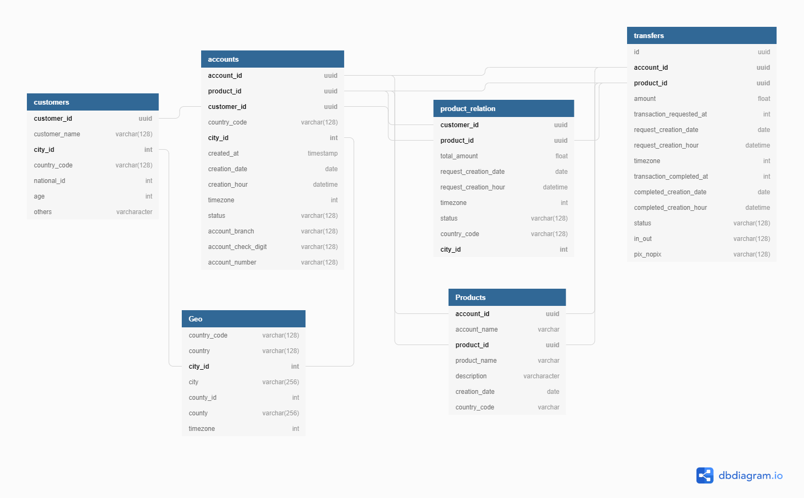
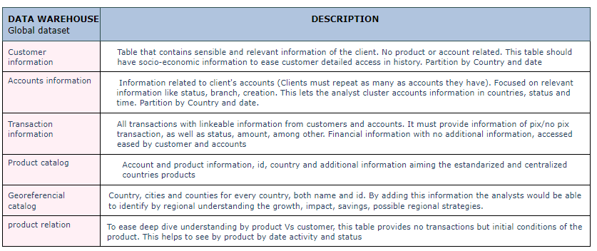
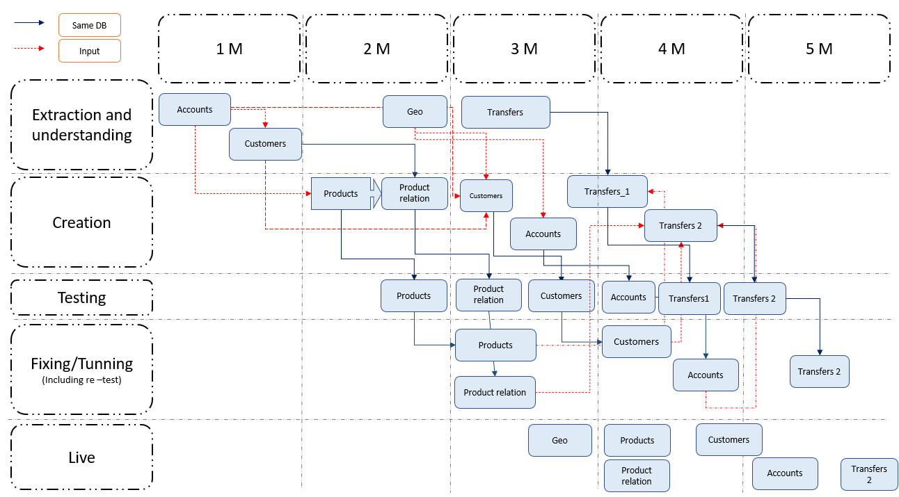

# Monthly-Account-Balance


<div class="alert alert-block alert-info" style="margin-top: 20px">
<b><center><font size="6"> Analytics Engineer </font></b>
  
  
  
<h1>Table of Contents<span class="tocSkip"></span></h1>

<div class="toc"><ul class="toc-item"><li><span><a href="#Account-Monthly-Balance" data-toc-modified-id="Account-Monthly-Balance-1"><span class="toc-item-num">1&nbsp;&nbsp;</span>Account Monthly Balance</a></span>
<div class="toc-item"><li><span><a href="#Data-Warehouse-Architecture" data-toc-modified-id="Data-Warehouse-Architecture-1"><span class="toc-item">2&nbsp;&nbsp;</span>Data Warehouse Architecture</a></span>
    <div class="toc-item"><li><span><a href="#Timeline-execution-plan" data-toc-modified-id="Timeline-execution-plan-1"><span class="toc-item">3&nbsp;&nbsp;</span>Timeline execution plan</a></span>
<div class="toc-item"><li><span><a href="#PIX-KPIs" data-toc-modified-id="PIX-KPIs-1"><span class="toc-item">4&nbsp;&nbsp;</span>PIX KPIs</a></span>
<div class="toc-item"><li><span><a href="#Annex" data-toc-modified-id="Annex"><span class="toc-item">5&nbsp;&nbsp;</span>Annex</a></span>
  
  
The exercise was executed in ***AWS (Amazon Web Services)***, especifically ***Athena*** service. This service is based on SQL-Hive, both database and process were uploaded and executed in this service.

- To review code and enviroment, please refer to: **ACÁ IRÁ EL LINK PARA AMAZON WEB SERVICES**
- To review **code especifications**, please refer to Annex.
  
  
# Account Monthly Balance

---
  
 1. Create a SQL file to help Jane retrieving the monthly balance of all accounts (this query should be made using the warehouse structure before the changes you propose on 2.)

Refer to Annex for code: <div class="toc-item"><li><span><a href="#Annex" data-toc-modified-id="Annex"><span class="toc-item">5&nbsp;&nbsp;</span>Annex</a></span>
  

  
# Data Warehouse Architecture

---
	
2. Improve the data warehouse architecture and justify your changes
 
	
	
## Why these changes?

In order to have standard information, centralized and escalable data, we need to merge and keep history with multiples variables that help to access easiy to whole core information that can  provide better insights to business. It means, that all customers, accounts and transactions must be centralized in a same dataset and looking forward to be efficient for access and effective as unique source.  By unifying Transactions, the extraction by product and type would help to understand the behavior easier than separate sources.
	
Time tables would be disable since date, hour and timezone would be included in transfers, accounts and product in order to ease access instead of consume resources by different tables. Plus, by having date in the table, month, week and day information are able to be extracted easier.
	
Both products relation and product are oriented to extend information to the customers and accounts. However, products relation is the initial status that each client/customer had at the beginning of each product afforded by the customer and, products is a catalog with its relation to an account. Example: A loan is an account that contains multiple products like mortgage credit, Car loan and so on. 

 
	
The information provided by these tables are going to be oriented to satisfy business needs since 3 different sources provide global information but centralized in each matter. As well as unique source for several tables and possible inputs in different analysis
	
	
  
  
# Timeline execution plan

---

A 5 Months time-window process would include several steps throughout different scenarios. Stakeholders included are Engineering team; Business areas to understand products, business cases and considerations; System leaders and teams for features and possible improvements. This stakeholders would be aware from the beginning to match information, enable tools and possible resources.
		
While the current architecture works, Customer and Accounts should be the first tables to work on since they would lead the structure for products relation and future transactions breakdown. It means they will be the main input to create products and products relation as well as Geo dataset.
	
1. **Extraction and understanding:** This step will include system understanding, business understanding and raw table structure deep dive.
2. Creation: Product and product relation would be created first taking into account Geo, customer and accounts information. Once products tables are created, additional information would be included to Customers and Accounts according to new DWH proposed.
3. Test: Testing would be set on production enviroment in order to created temporal sights to match current and historical information for products, relation, customers and accounts.
4. Fixing and Tunnning: After testing, feedback would be considered in case any discrepancy comes up. It includes re-testing to guarantee equality in results and history process
5. Live: Once on Live - In DWH -, previous tables must be shutted down gradually to avoid results damage, business processes and unmatch of information.
	
Transactions is the only table that would have 2 parts. 
	- Transfers 1: No breakdown included but only general account matching with current business accounts. This includes PIX and No PIX
	- If transfers 1 matches, Transfers 2 would have product breakdown, and accounts as well in order to  match whole information with tranfers 1.
	
  

	
# PIX KPIs

---
  
  
# Annex

---
  
  
### Account Monthly Balance

---
  
The process for *Account Monthly Balance*

```SQL
with customer as (
	select distinct customer_id,
		first_name,
		last_name
	from "nubankdb"."customers"
), --- Table with customer information 
accounts as (
	select distinct account_id,
		customer_id
	from "nubankdb"."accounts" 
	where status = 'active'
), --- Table with accounts information (join with customer)
time as(
select intrans.account_id,
    monthdb.action_month
from (
		select account_id,
			amount as in_amount,
			0 as out_amount,
			transaction_completed_at,
			month(
				from_unixtime(cast(transaction_completed_at as bigint) / 1000)
			) as month_1
		from "nubankdb"."intrans"
		where status = 'completed'
	) as intrans --- Transactions as baseline
	left join (
		select time_id,
			month_id
		from "nubankdb"."d_time"
	) as time on time.time_id = intrans.transaction_completed_at --- month_id
	left join(select month_id,
			action_month
		from "nubankdb"."d_month"
	) as monthdb on time.month_id = monthdb.month_id --- action_month
), --- Table to extract month and compare to unixtime (Same)
trans as(
	select account_id,
		month,
		sum(in_amount) as intrans,
		sum(out_amount) as outtrans,
		sum(in_amount) - sum(out_amount)  as Account_Monthly_Balance
	from (
			select account_id,
				amount as in_amount,
				0 as out_amount,
				month(
					from_unixtime(cast(transaction_completed_at as bigint) / 1000)
				) as month
			from "nubankdb"."intrans"
			where status = 'completed' --- Only completed actions will be taken
			union all
			select account_id,
				0 as in_amount,
				amount as out_amount,
				month(
					from_unixtime(cast(transaction_completed_at as bigint) / 1000)
				) as month
			from "nubankdb"."outtrans"
			where status = 'completed' --- Only completed actions will be taken out transfers
			union all
			select account_id,
				case --- out transfers based on in pix transactions
					in_or_out
					when 'pix_in' then cast(pix_amount as double) else 0
				end as in_amount,
				case --- out transfers based on out pix transactions
					in_or_out
					when 'pix_out' then cast(pix_amount as double) else 0
				end as out_amount,
				month(
					from_unixtime(cast(pix_completed_at as bigint) / 1000)
				) as month
			from "nubankdb"."pix_mov"
			where status = 'completed' --- Only completed
		)
	group by account_id,
		month
)
select trans.month,
	accounts.customer_id,
	customer.first_name,
	customer.last_name,
	trans.intrans,
	trans.outtrans,
	trans.Account_Monthly_Balance
from accounts
	right join trans on accounts.account_id = trans.account_id --- Accounts -> Transactions
	left join customer on customer.customer_id = accounts.customer_id --- Customers -> accounts
group by trans.month,
	trans.month,
	accounts.customer_id,
	customer.first_name,
	customer.last_name,
	trans.intrans,
	trans.outtrans,
	trans.Account_Monthly_Balance
```
